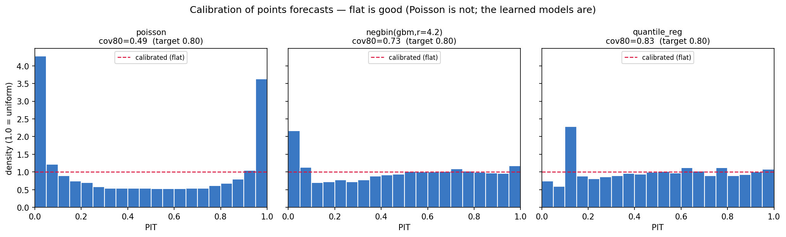

# Calibrated NBA Box-Score Forecasting

Most player projections predict **a number** and report MAE. But a number can't
tell you the *chance* a player clears 20 points, and MAE hides whether a model
knows what it doesn't know. This project predicts the **full distribution** of a
player's next game and scores it with **proper scoring rules** — CRPS, log-score,
and calibration (PIT) — then shows that the obvious baseline is badly overconfident
and two better models fix it.



**Read the figure:** a calibrated model's PIT histogram is **flat**. Naive Poisson
is a deep U — the actual outcome lands in the tails it called unlikely, so its "80%
interval" really covers only **49%**. The learned models flatten it out.

## Results (test season held out, n≈28k player-games)

**Points** — 80% interval should contain the outcome 80% of the time:

| model | CRPS ↓ | cov80 (→0.80) | PIT mean (→0.50) |
|---|---|---|---|
| Poisson (trailing mean) | 3.549 | **0.49** | 0.48 |
| NegBinomial (GBM mean + dispersion) | 3.337 | 0.73 | 0.49 |
| **Quantile Regression** | **3.274** | **0.83** | 0.50 |

Same pattern across rebounds, assists, and threes: the naive baseline is
overconfident; the learned models are both **sharper (lower CRPS)** and
**calibrated**. (`python -m calib_forecast.forecast` prints all four.)

## What it does

1. **Leakage-safe features** — trailing 5- and 10-game rollups per player, shifted
   one game so no future info leaks. Train on past seasons, evaluate on the most
   recent.
2. **Three models, increasing sophistication:**
   - **Poisson(trailing mean)** — the naive baseline.
   - **Negative Binomial(GBM mean, fitted dispersion)** — a learned mean plus the
     right over-dispersion (NBA counts are more variable than Poisson allows).
   - **Quantile Regression (gradient-boosted)** — learns the conditional quantiles
     directly, so calibration is optimized natively.
3. **Proper evaluation** — CRPS and log-score (not MAE), plus PIT calibration and
   interval coverage. Distributions are judged as distributions.

## Run it

```bash
pip install -r requirements.txt
python -m calib_forecast.forecast    # the scoreboard (all 4 stats)
python -m calib_forecast.plot        # regenerate the calibration figure
```

Ships with a bundled box-score sample (`data/box_scores.parquet`, ~85k
player-games), so it runs with no setup, no API keys, and no GPU.

## Why it matters

Calibration is the difference between a model that *looks* accurate and one you can
*act on*. A properly calibrated distribution tells you not just the expected value
but how confident to be — which is exactly what's missing from MAE-only projections.
The same toolkit (CRPS / log-score / PIT) applies to any count-forecasting problem:
demand, claims, defects, arrivals.

## Scope

A forecasting/calibration methodology demo on public NBA box-score data. Not a
betting tool — it makes no claim to beat a market.

## License
MIT — see [LICENSE](LICENSE).
